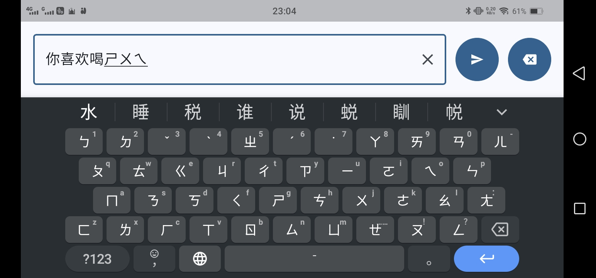

# pc_text_input_app

v0.0.1

Last Updated on 2026-06-26
<hr />


Android app that turns Gboard into a wireless UTF-8 keyboard for Windows and Linux over HTTPS.

<!-- 
## 🎬 Demo

[▶️](https://www.youtube.com/watch?v=23YITX75awo)
 -->
https://github.com/HuzaifaIrfan-Desktop/pc-text-input-server



# 🚀 Usage


## Run App

```sh
flutter run
```

## Build APK


```sh
flutter build apk
```


# 📝 Documentation

# 📚 References

# 🤝🏻 Connect with Me

## Huzaifa Irfan

- 💬 Just want to say hi?
- 🚀 Have a project to discuss?
- 📧 Email me @: [hi@huzaifairfan.com](mailto:hi@huzaifairfan.com)
- 📞 Visit my Profile for other channels:

[](https://github.com/HuzaifaIrfan/)
[](https://www.huzaifairfan.com)

# 📜 License

Licensed under the GPL3 License, Copyright 2026 Huzaifa Irfan. [LICENSE](LICENSE)
